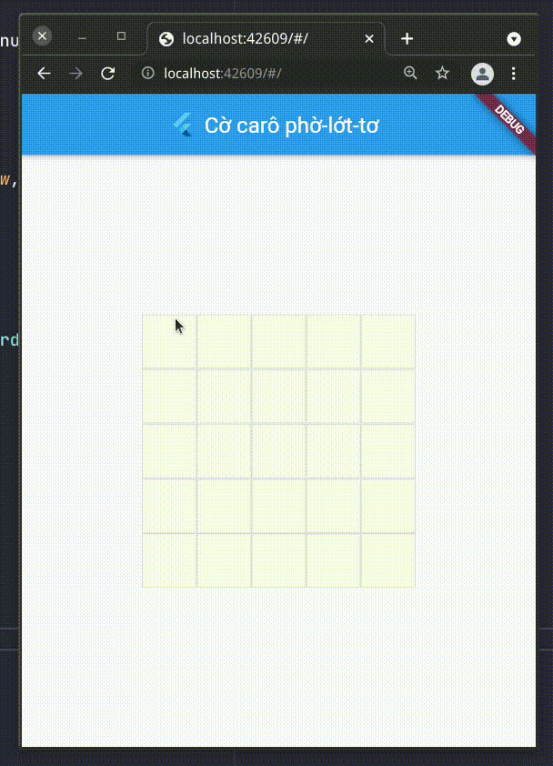
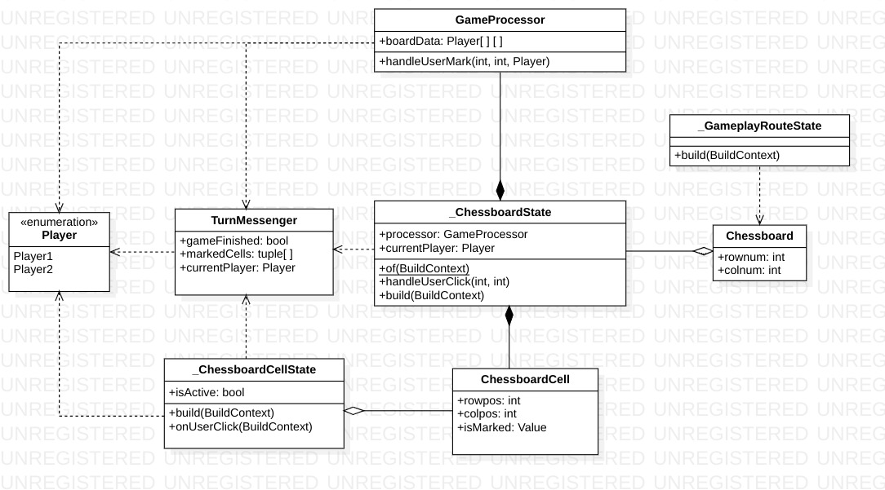

Product under development.

# Introduction
This is a simple Gomoku game (Vietnamese variant - "cờ carô") written in Flutter.

Rule: the winner must have an overline or an unbroken row of five stones that is not blocked at either end (overlines are immune to this rule).  

# Class diagram
I have a habit of drawing a diagram to keep track where everything are. Fortunately, I have just finished OOP in  uni, so with this project I keep a copy of its class diagram (simplified).  
I'm not too familiar with design patterns, so I made up this structure without any explicit reference to any design pattern, so don't be surprised if it's too bad.

# Implementation note
## Initialization flow
1. `main()` first instantiates a `Provider`, which holds a `BoardSize` object. This `Provider` also encloses a `MaterialApp`, whose `body` is set to an instance of `HomescreenRoute`.
2. `HomescreenRoute` is built and asks the user to specify the dimensions for the game board. The results are stored in top-level `Provider`.
3. When user taps the `Play` button, the app switches to `GameplayRoute`, whose `build()` method instantiates a `Gameboard`.
4. A `Gameboard` is initialized along with its `_GameboardState`.
5. `_GameboardState` fetches the `BoardSize` value from the top-level `Provider` and instantiate a `GameProcessor`, along with other crucial variables.
6. The `build()` method of `_GameboardState` is called, calculating the size of `BoardCell`s accordingly to the received `BoardSize`. If the size is too small to be playable, a warning message will be returned, and the user will be redirected to the homescreen.
7. If the app passed the previous step, a grid of `BoardCell`s will be created.
8. The `build()` method of `_BoardCellState` returns a `GestureDetector`.

<!-- 1. `main()` initializes a `MaterialApp` object, which then creates a `HomescreenRoute`, eventually becoming the home widget.
2. `HomescreenRoute` asks the user to specify dimensions for the game board. The results are saved to the `globals` library.
3. After the "Play" button is clicked, a new `GameplayRoute` is created and laid out to the UI.
4. `GameplayRoute`'s build method returns a `Scaffold`, whose body is an instance of `GameBoard`.
5. `_GameboardState` reads the board dimensions from `globals` and initalizes a grid of `BoardCell`s accordingly. If the cells are too small to be playable, an exception will be raised and the program will return back to `HomescreenRoute`. -->

## Handling user click on the `BoardCell`s
The `build` method of `_BoardCellState` returns a `GestureDetector`, whose `onTap` property points to the `_BoardCellState.onUserClick` function.
1. When user clicks on a `BoardCell`, `_BoardCellState.onUserClick()` is invoked.
2. The method searchs for the nearest (and only) `_GameboardState` up in the widget tree.
3. The method calls the `_GameboardState.handleUserClick(int, int)` method from its parent.
4. The parent `_GameboardState` now has received the call from its child. Now it should notify the caller the current player of the game (player 1 or player 2) ("passed" through its return value).
5. The calling `_BoardCellState` now knows which player is playing and should display an `O` or `X` mark accordingly to the current player. It also locks its state to prevent further changes to its status.

6. `_GameboardState` passes the location of the just clicked cell in the grid to `GameProcessor`.
7. `GameProcessor` should process the incoming information and returns a `TurnMessenger` object.
8. `_GameboardState` receives the response from `GameProcessor` and should whether decide to do the following things if the game has finished:
    - Lock the Gameboard.
    - Mark the cells.
    - Show the winner's name.
